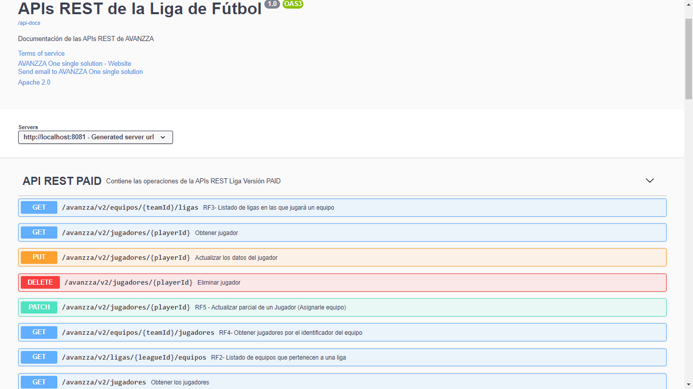
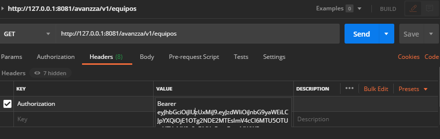

# LEAGUE API REST
API REST que expone servicios de la Liga Nacional de Fútbol desarrollada por [AVANZZA One single solution  (Avanzza)](http://www.avanzza.io/).
La API REST fue desarrollada con `Spring Boot`, `Spring Data`, `JPA` y `MySQL`. Se implementan como buenas prácticas la paginación, 
versionado y validaciones. Para escribir un código más simple y legible se aplican anotaciones, implementan validadores y emplea `Lombok`. 
Para el manejo de recursos e hipertexto empleo `Spring HATEOAS`, para la seguridad `Spring Security` y seguiridad basada en tokens (`JWT`). 
Para gestionar migraciones `flyway`. El proyecto cuenta con una API versión FREE y una API versión PAID. Empleo `guava` e implemento una anotación de validación `Throttling` para limitar la cantidad de peticiones que se realizan a la versión FREE.

La API fue documentada con `Open API Sagger` y testeada con `Postman` y pruebas automatizadas con `JUnit`
Y los paquetes fueron estructurados siguiendo `Driver Domain Design`

Ruta de swagguer: `http://localhost:8081/swagger-ui/index.html?configUrl=/api-docs/swagger-config/`

### Instalación
1. `Intellij IDEA` como IDE de desarrollo. Descargar [aquí](https://www.jetbrains.com/es-es/idea/download/).
2. Instalar en el IDE el plugin `Lombok`. Para Intellij descargar [aquí](https://plugins.jetbrains.com/plugin/6317-lombok/). 
3. `MySQL v8.0` como gestor de BD. Descargar [aquí](https://dev.mysql.com/downloads/mysql/).
4. `Postman` para probar los endpoint de las APIs. Descargar [aquí](https://www.postman.com/downloads/).
5. `MAVEN` para gestionar las dependencias. Descargar [aquí](https://maven.apache.org/download.cgi/).
   El `pom/xml` contiene todas las dependencias que deben ser descargadas para el despliegue de este proyecto.

## Consideraciones para correr el proyecto
1. Descargar el proyecto e importarlo. Puede clonarlo desde: `https://github.com/grleyvaj/APIsREST_Liga.git
2. En el `application.properties` se han configurado el user, password y nombre de la BD. 
    Según las configuraciones actuales que tiene el archivo debe tener una BD en MySQL llamada `avanzza` con user y password `root`
4. Automáticamente se ejecutarán las migraciones almacenadas en la ruta `db/migration`.
   El archivo `V1_1_0__my_first_migration.sql` cuenta con una carga inicial de la BD, referente a las tablas (DDL) y datos de prueba (DML)
   Para aplicar migraciones en tiempo de producción debe emplear el comando de MAVEN
   ```bash
   mvn flyway:migrate -Dflyway.configFiles=flyway.properties
   ```
   El archivo `flyway.properties` contiene las configuraciones para `flyway` del proyecto
5. Desplegado el proyecto, puede consultar los endpoint y los servicios que brinda la API.

  Vista de la Documentación de la API. Acceder [aquí](http://localhost:8081/swagger-ui/index.html?configUrl=/api-docs/swagger-config/). 
  
  
Puede importar en el Postman los archivos json almacenados en la carpeta `readme` del proyecto. 
Los json `Equipos.postman_collection.json`, `Jugadores.postman_collection.json`, `Ligas.postman_collection.json` y `Usuarios.postman_collection.json` contienen los endpoints que aprovisiona la API. 
Pero en el `HEADER` de cada endpoint debe definir los parámetros para especificar el token generado, de lo contrario no podrá acceder.
Key= `Authorization`
Value= `Bearer y seguido el token generado`

  Vista del Postman con esta configuración.
  

## Autenticación
1- Registrase. 

Variante1: importar en el Postman el json `Usuarios.postman_collection.json` y ejecutar con el método  `POST` el Request: `http://127.0.0.1:8081/avanzza/signup`

Variante2: adicionar manualmente el endpoint anterior y especificar Body/raw/JSON y en el cuerpo insertar los datos de un usuario para registrarlo. Ejemplo:
```bash
{
    "name":"Gloria",
    "username":"leyvajerezgr",
    "email":"leyvajerezgr@gmail.com",
    "password":"gl0r1@",
    "rol":"free"
}
```
2- Autenticarse. 

Variante1: importar en el Postman el json `Usuarios.postman_collection.json` y ejecutar con el método  `POST` el Request: `http://127.0.0.1:8081/avanzza/signin`

Variante2: adicionar manualmente el endpoint anterior y especificar Body/raw/JSON y en el cuerpo insertar los datos de un usuario para autenticarlo. Ejemplo:
```bash
{
    "username":"leyvajerezgr",
    "password":"gl0r1@"
}
```
Se genera un token de seguridad. Vista de Postman:
  
  
Desarrollé dos APIS:

    API versión Free (v1)
 
    API versión Paid (v2)
 
Si el usuario tiene un rol FREE podrá acceder a una API version Free y solamente podrá realizar 3 peticiones por minuto.
Los usuarios con rol PAID podrán acceder a la API versión Paid y no tienen límites de peticiones

Por tanto: 
El username "leyvajerezgr" registrado y autenticado anteriormente podrá acceder a la `API FREE` y realizar solo 3 peticiones por minuto. 
Si realiza otra petición retornará un error `Too many requests` con status `429`

### Endpoints aprovisionados por la API
CONDICIÓN: para acceder a los endpoint como se explicó anteriormente, cada petición debe tener en el HEADER el parámetro referente al token generado para el usuario autenticado.

NOTA: Los json de la carpeta `readme` ya tienen los endpoints con los parámetros de request, header, body, etc, inclyendo el HEADER, solo que el token debe actualizarlo por el que se le cree.

ENDPOINTS:

RF1- Listado de las ligas: 

    GET		`/avanzza/v1/ligas`

Ejemplos:	 
http://127.0.0.1:8081/avanzza/v1/ligas             
http://127.0.0.1:8081/avanzza/v2/ligas

RF2- Listado de equipos que participarán de una liga en particular:

	GET		`/avanzza/v1/ligas/{ligaId}/equipos`
Ejemplo: 	http://127.0.0.1:8081/avanzza/v1/ligas/1/equipos

RF3- Listado de todas las ligas en que participará un equipo en particular:

	GET		/avanzza/v1/equipos/{equipoId}/ligas
Ejemplo: 	http://127.0.0.1:8081/avanzza/v1/equipos/1/ligas

RF4- Listado de todos los jugadores de un equipo:

    GET		/avanzza/v1/equipos/{equipoId}/jugadores
Ejemplo: 	http://127.0.0.1:8081/avanzza/v1/equipos/1/jugadores

RF5- Incorporación de jugador (ya existente) a un equipo: 

    PATCH	/avanzza/v1/jugadores/{jugadorId}
Ejemplo:	http://127.0.0.1:8081/avanzza/v1/jugadores/1

RF6- Creación de un jugador:

    POST		/avanzza/v1/jugadores
Ejemplo:	http://127.0.0.1:8081/avanzza/v1/jugadores

El resto de los endpoints de la API pueden consultarse en la documentación [swagger](http://localhost:8081/swagger-ui/index.html?configUrl=/api-docs/swagger-config/). 
(Para poder acceder a esta documentación se requiere que el proyecto esté corriendo).

LIGA
- Obtener liga por si identificador: GET `/avanzza/v1/ligas/{ligaId}`
- Adicionar liga: POST `/avanzza/v1/ligas`
- Actualizar liga: PUT `/avanzza/v1/ligas/{ligaId}`
- Eliminar liga: DELETE `/avanzza/v1/ligas/{ligaId}`

EQUIPO
- Listado de equipos: GET `/avanzza/v1/equipos`
- Obtener equipo por si identificador: GET `/avanzza/v1/equipos/{equipoId}`
- Adicionar equipo: POST `/avanzza/v1/equipos`
- Actualizar equipo: PUT `/avanzza/v1/equipos/{equipoId}`
- Eliminar equipo: DELETE `/avanzza/v1/equipos/{equipoId}`

JUGADOR
- Listado de jugadores: GET `/avanzza/v1/ jugadores`
- Obtener jugador por si identificador: GET `/avanzza/v1/ jugadores/{jugadorId}`
- Adicionar jugador: POST `/avanzza/v1/jugadores`
- Actualizar jugador: PUT `/avanzza/v1/jugadores/{jugadorId}`
- Eliminar jugador: DELETE `/avanzza/v1/jugadores/{jugadorId}`

USUARIO
- Adicionar usuario: POST `/avanzza/signup`
- Autenticar usuario: POST `avanzza/signin`

ERRORES
status `401` Unauthorized: No se ha autenticado y se autenticó pero en la petición no especificó el token
status `429` Too many requests:  El usuario que realiza la petición es FREE y no tiene permisos para realizar más de 3 peticiones por minuto
status `409` Not Found: El recurso solicitado no se encuentra
He manejado otras excepciones cuyos status se encuentran también detallados en la documentación de la API
[aquí](http://localhost:8081/swagger-ui/index.html?configUrl=/api-docs/swagger-config/). 

### Archivos y clases puntuales
- archivo `flyway.properties` contiene las configuraciones para `flyway` del proyecto
- archivo `application.properties` contiene las configuraciones del proyecto como DB, encoding, ruta para api-doc, etc.
- las clases `Constant` almacenan la documentación, es para simplificar las clases controladoras, dejarlas con el mínimo de doc swagger.
- la clase `URIConstant` es donde he definido las URI del proyecto, para si en un futuro se desean cambiar, ir solo a este archivo en lugar de cada API.

### Pruebas con JUnit
Implementé un grupo de pruebas automatizadas que se encuentran en la carpeta `test` del proyecto


